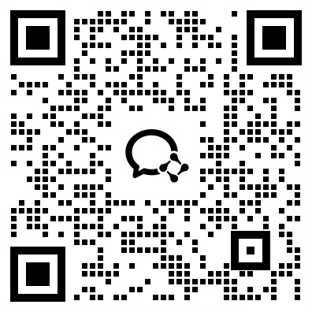

<div align="center">

# TuPrompt

**从网页图片直接生成 AI 绘图提示词的 Chrome 扩展**

*Source-available Chrome extension for generating AI image prompts from web images.*

[English](README_EN.md) | **简体中文**

<br />


</div>

---

> [!TIP]
> **TuPrompt** 适合在 Pinterest、商品页、海报图、灵感图等场景里，直接把“看图 -> 拆解 -> 写 Prompt”这条链路缩短成一次右键操作。

## ✨ 项目介绍

TuPrompt 是一个 Chrome 扩展，用于在网页图片上右键分析画面内容，并生成适合 Midjourney、Stable Diffusion、DALL-E、Adobe Firefly 等 AI 绘图工具使用的提示词。

它的目标很直接：

- 让你在浏览灵感图、商品图、海报图、Pinterest 图片时，直接生成可用的 AI 提示词
- 尽量减少来回切换工具和手工描述图片的时间
- 把“看图 -> 拆解 -> 写 Prompt”这件事变得更快、更顺手

## 🧩 核心能力

<table>
<tr>
<td width="50%" valign="top">

### Prompt Workflow

- 右键网页图片快速生成 AI 绘图提示词
- 支持英文 Prompt 和中文注释分区显示
- 支持一键复制英文 Prompt、中文注释或完整结果

</td>
<td width="50%" valign="top">

### Image Compatibility

- 适配 Pinterest 等图片平台
- 支持懒加载图片、高清 `srcset` 图片和背景图
- 支持多模型与多 API 网关接入

</td>
</tr>
</table>

## 🤖 支持的模型入口

`GPT-4o` `Claude` `Gemini` `海螺 Minimax` `豆包 Doubao` `智谱 GLM-4V` `通义千问 VL` `Jeniya Gemini` `自定义 API`

## 🚀 使用方法

1. 在 Chrome 扩展管理页开启开发者模式。
2. 选择“加载已解压的扩展程序”，加载本项目目录。
3. 点击扩展图标，配置想使用的模型 API Key。
4. 打开任意网页，在图片上右键。
5. 选择“TuPrompt”下的模型菜单，等待分析结果。
6. 在结果弹窗中复制英文 Prompt 或中文注释。

## 🔄 数据流说明

TuPrompt 不使用自有服务器。扩展会在用户主动右键分析图片时，从当前网页获取图片地址或图片数据，并发送到用户选择的第三方 AI 服务商 API。API Key 保存在 Chrome 扩展存储中，用于向对应服务商发起请求。

## 🛠️ 本地开发

这是一个原生 Chrome Manifest V3 扩展，没有构建步骤。修改代码后，在 Chrome 扩展管理页点击“重新加载”即可测试。

可用以下命令检查脚本语法：

```bash
node --check background/service-worker.js
node --check content/content.js
node --check popup/popup.js
```

## 📦 发布打包

发布前请确认不包含 `.git`、临时文件、测试截图、私有 API Key 等内容。建议打包时只包含：

- `manifest.json`
- `background/`
- `content/`
- `popup/`
- `icons/`

## 📜 许可与使用范围

本仓库采用自定义的非商用源码许可。

- 允许查看、学习、Fork 和修改代码
- 允许个人用途、学习用途、评估用途和其他非商用用途
- 不允许未授权商用
- 不允许将本项目或其修改版用于收费产品、收费服务、白标分发或其他商业用途

详细条款请查看 `LICENSE` 和 `COMMERCIAL_USE.md`。

## ❤️ 支持项目

如果这个项目对你有帮助，欢迎支持项目维护和后续更新。

> 赞助或捐赠 **不代表** 获得商用授权或商业许可。

<table>
<tr>
<td align="center" width="50%">
<strong>微信赞赏</strong><br /><br />

</td>
<td align="center" width="50%">
<strong>支付宝赞赏</strong><br /><br />

</td>
</tr>
</table>

更完整的赞助说明请查看 `SUPPORT.md`。

## 🌍 社区交流群

欢迎跨境卖家、AI 产品开发者，以及对 AI 出海产品感兴趣的朋友加入交流群。

<table>
<tr>
<td align="center" width="50%">
<strong>企业微信交流群</strong><br /><br />

</td>
<td align="center" width="50%">
<strong>个人微信联系</strong><br /><br />

</td>
</tr>
</table>

如果你希望添加 Giien Global 的个人微信进行项目相关沟通，请在添加好友时备注来意。

社区详情请查看 `COMMUNITY.md`。

## 🔐 隐私

请查看 `PRIVACY_POLICY.md`。上架 Chrome Web Store 时，需要将隐私政策发布到一个公开可访问的 URL，并填写到开发者后台。
